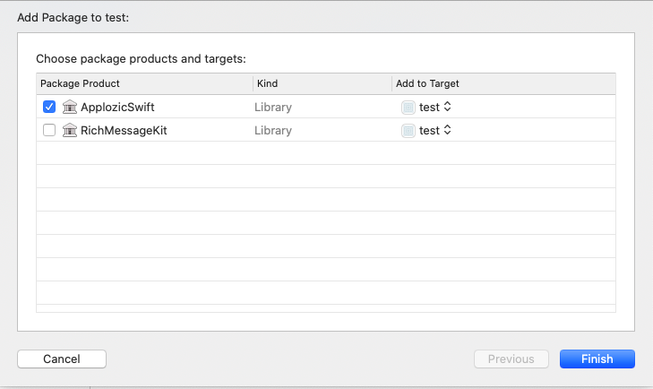

<div style="width:100%">
<div style="width:50%; display:inline-block">
<p align="center">

</p>
</div>
</div>

# Official iOS Swift SDK for [Chat](https://docs.applozic.com/docs/ios-integration-overview) :speech_balloon:


## Introduction :cyclone:     


Applozic brings real-time engagement with chat, video, and voice to your web,
mobile, and conversational apps. We power emerging startups and established
companies with the most scalable and powerful chat APIs, enabling application
product teams to drive better user engagement, and reduce time-to-market.

Customers and developers from over 50+ countries use us and love us, from online
marketplaces and eCommerce to on-demand services, to Education Tech, Health
Tech, Gaming, Live-Streaming, and more.

Our feature-rich product includes robust client-side SDKs for iOS, Android, React
Native, and Flutter. We also support popular server-side languages, a beautifully
customizable UI kit, and flexible platform APIs.

Chat, video, and audio-calling have become the new norm in the post-COVID era,
and we're bridging the gap between businesses and customers by delivering those
exact solutions.

## Table of Contents :beginner:

* [Prerequisites](#prerequisites)
* [Quick Start](#quickstart)
* [Setting Up Xcode for new project](#setting-xcode-project)
* [Integrating SDK in your App](#setup-sdk)
* [Announcements](#announcements)
* [Roadmap](#roadmap)
* [Features](#feature)
* [About](#about)
* [License](#license)

<a name="prerequisites"></a>
## Prerequisites :crystal_ball:

- Install the following:

* [Xcode](https://apps.apple.com/us/app/xcode/id497799835?mt=12) 13.0 or later
* [CocoaPods](https://cocoapods.org/) 1.9.0 or later

- Make sure that your project meets these requirements:

* Your project must target iOS 12 or later.
*  Set up a physical or simulator iOS device to run your app
- [Sign-Up](https://www.applozic.com/signup.html?utm_source=github&utm_medium=readme&utm_campaign=ios) or Login to get your Applozic's [API key/App Id](https://console.applozic.com/settings). <br>

<a name="quickstart"></a>
## Quick Start :rocket:

<a name="setting-xcode-project"></a>
### Setting up Xcode project

* Open Xcode Create a new project **Select App** and Click Next 
* Set the Product Name as per your preference (we will name it as **applozic-first-app**) and click Next and Select folder then Create.

<a name="setup-sdk"></a>
### 1. Setup

#### Include the ApplozicSwift SDK for iOS in an Existing Application

The iOS ApplozicSwift SDK can be installed using CocoaPods or Swift Package Manager, as you prefer.

### Install ApplozicSwift with CocoaPods

ApplozicSwift is available through [CocoaPods](https://cocoapods.org). To install
it

1. Open Terminal
2. Navigate to the root directory of your Project (the directory where your *.xcodeproj file is)
3. Run command

```bash
pod init
```

Again go to your Project's root directory, click on the "Podfile" to open.
Copy-paste the following code in the file and Save

```ruby
source 'https://github.com/CocoaPods/Specs'
use_frameworks!  # Required to add 
platform :ios, '12.0'

target 'TARGET_NAME' do
pod 'ApplozicSwift'  # Required to add 
end
```

4. Go to your project directory where Podfile there run `pod install` or `pod update` from terminal to refresh the CocoaPods dependencies.

5. Open your project newly generated `*.xcworkspace` or existing and build your project.

### Install ApplozicSwift with Swift Package Manager  

Install via Xcode 

1. In Xcode, install the ApplozicSwift SDK by navigating to File > Swift Packages > Add Package Dependency…

2. In the prompt that appears, select the ApplozicSwift GitHub repository:

```swift
https://github.com/AppLozic/ApplozicSwift.git
```

3. Select the version of ApplozicSwift you want to use. For new projects, we recommend using the newest version of ApplozicSwift.

4. Once you click the Next button Select the ApplozicSwift package product and it will look like below and click finish.



### Add Permissions

App Store requires any app which accesses camera, contacts, gallery, location, a microphone to add the description of why does your app needs to access these features.

In the `Info.plist` file of your project. Please add the following permissions

```xml
<key>NSCameraUsageDescription</key>
<string>Allow Camera</string>
<key>NSContactsUsageDescription</key>
<string>Allow Contacts</string>
<key>NSLocationWhenInUseUsageDescription</key>
<string>Allow location sharing!!</string>
<key>NSMicrophoneUsageDescription</key>
<string>Allow MicroPhone</string>
<key>NSPhotoLibraryUsageDescription</key>
<string>Allow Photos</string>
<key>NSPhotoLibraryAddUsageDescription</key>
<string>Allow write access</string>
```

### Importing Methods for Authentication

The method file that we need here is `ALChatManager` files.

1. Download the `ALChatManager.swift` [here](Demo/ApplozicSwiftDemo/ALChatManager.swift)
2. Add the downloaded `ALChatManager.swift` in your project by clicking on Add Files option on any folder
3. Open `ALChatManager.swift` file in your Xcode and Replace "applozic-sample-app" with your App ID from [here](https://console.applozic.com/settings)


### 2. Register/Login the User

The authentication process allows you to create users or log them into chat whenever necessary. 
This is usually done along with the login or registration of users within your app i.e. within the login or register buttons in your app.

```swift
let alUser : ALUser =  ALUser()
alUser.applicationId = <PASS_YOUR_APP_ID_HERE>
alUser.userId = "demoUserId" // NOTE : +,*,? and space are not allowed chars in userId.
alUser.email = "github@applozic.com"
alUser.imageLink = ""  // User's profile image link.
alUser.displayName = "DemoUserName"  // User's Display Name
alUser.password = "testpassword" //User password

//Saving these details
ALUserDefaultsHandler.setUserAuthenticationTypeId(Int16(APPLOZIC.rawValue))

//Registering or Login in the User
ALChatManager.shared.connectUser(alUser, completion: { response, error in
    if error != nil {
        print("Error while logging \(String(describing: error))")
    } else {
        print("Successfull login")
    }
})
```
**Note:** Another thing you must understand is, in case of ApplozicSwift SDK both Registering a new user and loging in an existing user has the same process and code.
### 4. Opening a conversation and sending the first message

Implement the following code at the event or Button action designated for opening a one to one conversation for sending a message Pass the ``RECIPIENT-USERID``

```swift
ALChatManager.shared.launchChatWith(contactId: <RECIPIENT-USERID>, from: self)
```

### 5. Launch chat list

Implement the following code at the event or Button action designated for showing chat list screen.

```swift
ALChatManager.shared.launchChatList(from: self)
```

### 5. Logout user

On logout of your app you need to logout the applozic user as well use the below method to logout the user:  

```swift
ALChatManager.shared.logoutUser { _ in
   print("Logout successfully")
}
```

<a name="docs"></a>
## Documentation
We recommend to go through some basic documentation for [ApplozicSwift Chat & Messaging SDK Documentation](https://www.applozic.com/docs/ios-chat-sdk.html?utm_source=github&utm_medium=readme&utm_campaign=ios) :memo: <br>

<a name="announcements"></a>
## Announcements :loudspeaker: 

All updates to this library are documented in our [releases](https://github.com/AppLozic/ApplozicSwift/releases). For any queries, feel free to reach out us at github@applozic.com

<a name="roadmap"></a>
## Roadmap :vertical_traffic_light:

If you are interested in the future direction of this project, please take a look at our open [issues](https://github.com/AppLozic/ApplozicSwift/issues) and [pull requests](https://github.com/AppLozic/ApplozicSwift/pulls).<br> We would :heart: to hear your feedback.

<a name="feature"></a>
## Features :confetti_ball:

* One to one and Group Chat
* Image capture
* Photo sharing
* Location sharing
* Push notifications
* In App notifications
* Online presence
* Last seen at
* Unread message count
* Typing indicator
* Message sent
* Read Recipients and Delivery report
* Offline messaging
* User block/unblock
* Multi Device sync
* Application to user messaging
* Customized chat bubble
* UI Customization Toolkit
* Cross Platform Support(iOS, Android & Web)

<a name="about"></a>
## About & Help/Support :rainbow:

We provide support over at [StackOverflow](http://stackoverflow.com/questions/tagged/applozic) when you tag using applozic, ask us anything.

* Applozic is the best iOS chat sdk for instant messaging, still not convinced? 
- Write to us at github@applozic.com 
- We will be happy to schedule a demo for you.
- Special plans for startup and open source contributors.

* Android Chat SDK https://github.com/AppLozic/Applozic-Android-SDK
* Web Chat Plugin https://github.com/AppLozic/Applozic-Web-Plugin
* iOS ApplozicSwift Objective-C Sample project https://github.com/AppLozic/Applozic-Objective-C-Sample-App

<a name="license"></a>
## License :heavy_check_mark:
This code library fully developed and supported by Applozic's [team of contributors](https://github.com/AppLozic/ApplozicSwift/graphs/contributors):sunglasses: and licensed under the [BSD-3 Clause License](https://github.com/AppLozic/ApplozicSwift/blob/master/LICENSE).
